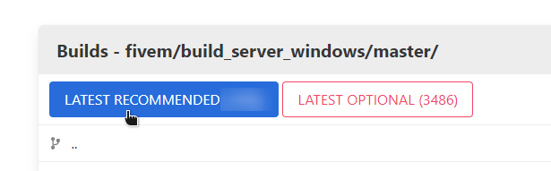
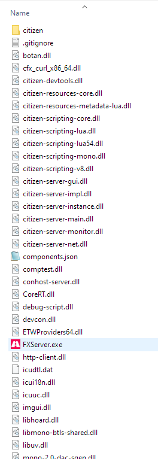
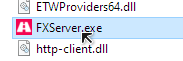
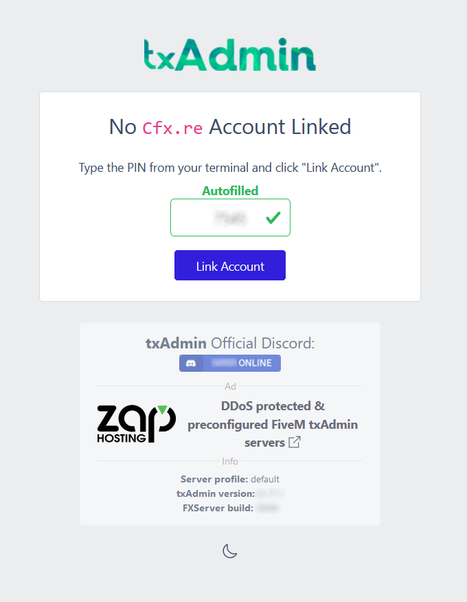

# Windows Intallation

## **Generate a Key**

Goto [Keymaster](https://keymaster.fivem.net/) login and generate a key for later use.

## **Download the server**

1. Go to the [Windows server build listing](https://runtime.fivem.net/artifacts/fivem/build\_server\_windows/master/) ('artifacts' listing, as in 'build artifacts').
2. Download the latest recommended build.

<figure><figcaption></figcaption></figure>

3. Open the `server.7z` you just downloaded. Use any third-party archiving tool (such as [7-Zip](https://www.7-zip.org/download.html) or [WinRAR](https://www.rarlab.com/download.htm)) to open the `.7z` file.
4. Create the following folder structure in your `C:\` drive
   * create folder `C:\redm`
   * create folder `C:\redm\server-data`
   * create folder `C:\redm\server-files`
5. Extract the filesfrom `server.7z` to `C:\redm\server-data`
6. Open the folder you just extracted it to. It should look a little like this:

<figure><figcaption></figcaption></figure>

## **Start the server**

1. Double click `FXServer.exe`

<figure><figcaption></figcaption></figure>

2. This site should open in your browser, make sure a PIN is filled and click `Link Account`.

<figure><figcaption></figcaption></figure>

3. Log in to your account on [Cfx.re](https://forum.cfx.re/) in this tab and then click `CONTINUE`

<figure><figcaption></figcaption></figure>

4. Set a password to log in to your server's admin page.

<figure><figcaption></figcaption></figure>

5. Click 'Next'.

<figure><figcaption></figcaption></figure>

6. Type a name for your server and click 'Next'.
7. Select 'Remote URL Template'

<figure><figcaption></figcaption></figure>

8. Enter the following URL into the box and click `Next`



<figure><figcaption></figcaption></figure>

9. Click `Change Path` and enter the following file path `C:\redm\server-data` and click `Save`

<figure><figcaption></figcaption></figure>

10. Click `Go to Recipe Deployer`

<figure><figcaption></figcaption></figure>

11. Review the recipe and click `Next`

<figure><figcaption></figcaption></figure>

12. Enter the key you just made on the [Keymaster](https://keymaster.fivem.net/) and then select `Run Recipe`

<figure><figcaption></figcaption></figure>

13. Wait for the recipe to finish and click `Next`

<figure><figcaption></figcaption></figure>

14. Click `Save & Run Server`

<figure><figcaption></figcaption></figure>

## **RSG RedM Server Build**

Watch the below video of me Installing a RSG RedM Server via txAdmin

**Recipe** : [https://raw.githubusercontent.com/Rexshack-RedM/txAdminRecipe/main/rsgcore.yaml](https://raw.githubusercontent.com/Rexshack-RedM/txAdminRecipe/main/rsgcore.yaml)



## **Addtional Requirements:**

* xampp : [https://www.apachefriends.org/](https://www.apachefriends.org/) or MariaDB [https://mariadb.org/download/](https://mariadb.org/download/)​
* artifacts : [https://runtime.fivem.net/artifacts/fivem/build\_server\_windows/master/](https://runtime.fivem.net/artifacts/fivem/build\_server\_windows/master/)
* redm : [https://redm.net/](https://redm.net/)​

## **Setup Ports**



this is for fivem but its also the same for redm servers
